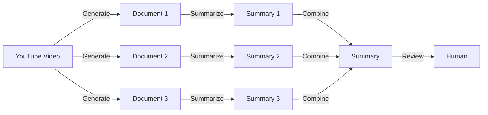

#### YouTube + Langchain + OpenAI Summarizer

This Python script harnesses the power of Langchain and OpenAI to extract text content from YouTube videos, split the text into manageable chunks, and apply a summarization chain using OpenAI's language model.

#### Prerequisites

1. Install the required dependencies
2. Clone the repository:
git clone [https://github.com/ericmaniraguha/QueryYoutubeLangchain.git](https://github.com/ericmaniraguha/QueryYoutubeLangchain.git)
cd QueryYoutubeLangchain
3. Install dependencies
pip install -r requirements.txt

4. Run the script:
python query_youtube_langchain.py

#### Configuration

Customize the following parameters in the `query_youtube_langchain.py` script:

* `youtube_url_list`: List of YouTube video URLs to process.
* `chunk_size` and `chunk_overlap`: Parameters for the text splitter.
* `chain_type`: Type of summarization chain (e.g., "map_reduce").

#### Results

#### Diagram: YouTube Video to Human Summary

The script generates summarized text content for each YouTube video in the specified list.

#### Acknowledgments

This project utilizes the Langchain library for document processing and OpenAI's language model for text summarization.

#### License

This project is licensed under the MIT License. Refer to the LICENSE file for details.
